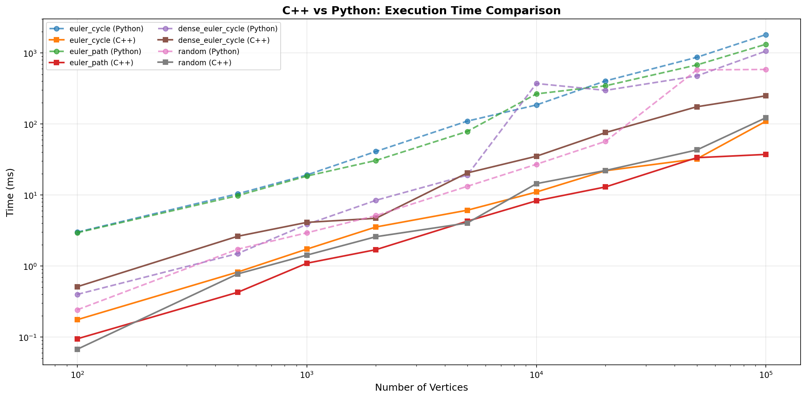
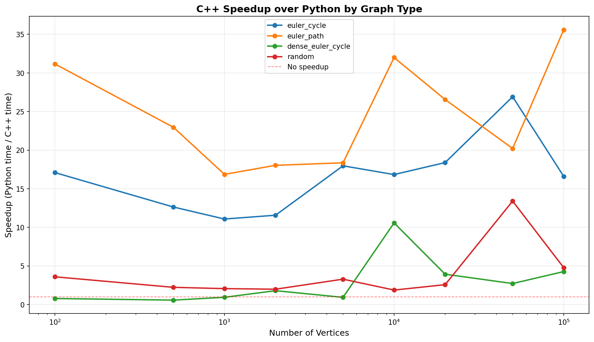
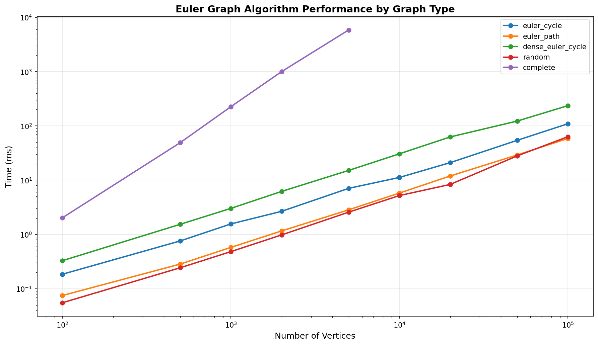

# Домашнє завдання 3

Автор роботи: Коновалов Лука

## Задача 
**Варіант 20**

Дано орiєнтований граф G = (V, E). Потрiбно:
- а) визначити, чи iснує в графi ейлеровий цикл (шлях, що проходить по кожному
ребру рiвно один раз i повертається в початкову вершину);
- б) якщо ейлеровий цикл не iснує, перевiрити iснування ейлерового шляху;
- в) у разi iснування — побудувати один iз них.

**Вхiднi данi**: кiлькiсть вершин, список орiєнтованих ребер.
**Вихiднi данi**: повiдомлення про вiдсутнiсть ейлерового шляху/циклу або послiдовнiсть вершин (або ребер), що утворюють такий шлях/цикл.

----

## Алгоритм

### Підготовка

Ми знаходимо Ейлерів цикл і шлях, Ейлерів - проходить по кожному ребру рівно один раз, для цього нам дуже важливе поняття степеня вершини:
\[
deg(v_i) = deg_{in}(v_i) + deg_{out}(v_i)
\]
Також важливим є поняття SCC(Strongly connceted component):
>SCC це множина вершин орієнтованого графу, така, що для будь-якої пари вершин з цієї множини, можна з першої дістатися другої і з другої дістатися першої.

### a) Визначити, чи iснує в графi ейлеровий цикл

Якщо б граф був не орієнтованим можна було би використати:

**Euler's Theorem:**
>A connected graph has an Euler cycle if and only if every vertex has an even number of incident edges.

Але у задачі орієнтований граф тому для перевірки чи існує ейлерів цикл використаємо властивість:

> A directed graph has an Eulerian cycle if and only if every vertex has equal  $deg_{in}$ and $deg_{out}$, and all of its vertices with nonzero degree belong to a single strongly connected component(SCC)

Ремарка: бібліотека networkx у своїй імплементації при перевірці на існування циклу перевіряє чи усі вершини, навіть з нульовим степенем, мають належити одній SCC, отже будь-який граф, який містить ізольвані вершини не буде мати ейлерівого циклу, я припускаю, що причиною цього є те, що вони використовують загальну перевірку на нележність scc усіх вершин, це не є помилково просто потрібно позбуватися ізольованих вершин перед перевіркою на існування Ейлерівого циклу. Але я дотримувався чіткого формулювання теореми про існування Ейлерівого циклу і опускав ізольовані вершини при перевірці на належність одній SCC. **Для перевірки на існування Ейлерівого шляху також**.


### б) Якщо ейлеровий цикл не iснує, перевiрити iснування ейлерового шляху

А для перевірки існування ейлерівого шляху використаємо, що:

>A directed graph has an Eulerian trail if and only if at most one vertex $v_i$ has $deg_{out}(v_i) − deg_{in}(v_i) = 1$, if such exists it is surely a start node of the trail, at most one vertex $v_j$ has $deg_{in}(v_j) − deg_{out}(v_j) = 1$, if such exists it is surely and end node of the trail, every other vertex has equal in-degree and out-degree, and all of its vertices with nonzero degree belong to a single connected component of the underlying undirected graph.

Ремарка: Очевидно $v_i \ne v_j$, адже одночасно не виконується, що:
\[deg_{out}(v_i) − deg_{in}(v_i) = 1, \quad deg_{in}(v_j) − deg_{out}(v_j) = 1, \quad v_i = v_j\]
І також важливо розуміти, що якщо існує початкова вершина так само має існувати кінцева і навпаки, це виходить із властивості орієнтованого графа, що:
\[\sum_{i=0}^{n}(deg_{in}(v_i) - deg_{out}(v_i)) = 0\]
### в) У разi iснування — побудувати один iз них.

Моя імплементація повертає:
- Ейлерів цикл, якщо він існує у вигляді списку вершин(можливі повтори вершин) у такому порядку, що перша і остання вершина однакова і якщо пройти від початкової до останньої, послідовність ребер, за якими були пройдені вершини, буде Ейлерівим циклом.
- Далі Ейлерів Шлях, якщо він існує, то повертає його у вигляді аналогічному до циклу з єдиною різницею, що перша і остання вершина не обов'язково однакові(у даній імплементації ніколи не однакові, адже якщо існує цикл, то він повертається, а лише якщо його не існує шлях) і послідовність ребер, за якими були пройдені вершини, буде Ейлерівим шляхом.
- якщо не існує ні ейлерівого цикли, ні шляху, тоді повертає порожній список вершин.

**Ремарка**: Якщо функція повертає порожній список, можлива також ситуація, що у графі немає жодного ребра і тоді Ейлерів шлях існує, але це тривіальний випадок, який можна перевірити без алгоритму.

### Знахоження Ейлерівого циклу/шляху

Для цього використовую алгоритм Ієрхольца (Hierholzer's algorithm), тому що він має найменшу асимптотичну складність $O(V + E)$ серед існуючих. Його суть:

1. Починаємо обхід з довільної вершини, яка містить хоча б одне ребро на вихід (для циклу) або з вершини, де $deg_{out} > deg_{in}$ (для шляху)
2. Проходимо по ребрах, видаляючи їх зі списку суміжності, поки не застрянемо
3. Коли застряємо (немає невідвіданих ребер), додаємо поточну вершину до результату
4. Повертаємося назад по стеку і продовжуємо з вершин, де залишилися невідвідані ребра
5. Реверсуємо отриману послідовність вершин

**Чому його можна використовувати і для шляху, і для циклу:**

Алгоритм однаково працює для обох випадків, відмінність лише у виборі стартової вершини. Для циклу всі вершини мають $deg_{in} = deg_{out}$, тому можна почати з будь-якої. Для шляху існує єдина вершина з $deg_{out} - deg_{in} = 1$ (початкова), з неї і починаємо. Решта логіки алгоритму ідентична, адже в обох випадках кожне ребро відвідується рівно один раз.

**Ремарка**: будь-який Ейлерів цикл також є Ейлерівим шляхом, тому лише коли не виконується умова існування циклу, відбувається перевірка на існування Ейлерівого шляху, тому коли будується шлях у даному алгоритмі точно існує початкова і кінцева вершина.

## Імплементація

Проєкт реалізовано на C++17 з використанням CMake. Основні компоненти:

### Структура файлів

- `include/euler.hpp` — публічний API модуля
- `include/utils.hpp` — допоміжні структури та функції
- `src/euler.cpp` — головна функція `euler_check_graph`
- `src/utils.cpp` — алгоритм Ієрхольца та перевірки зв'язності

### Основна функція

```cpp
std::vector<size_t> euler_check_graph(const size_t n, 
                                      const std::vector<std::pair<size_t, size_t>>& edges)
```

**Вхідні дані:**
- `n` — кількість вершин (індексація 0..n-1)
- `edges` — список орієнтованих ребер у форматі `{from, to}`

**Вихідні дані:**
- Непорожній `std::vector<size_t>` — послідовність вершин, що утворює Ейлерів цикл/шлях
- Порожній вектор — якщо не існує ні циклу, ні шляху, або не існує ребер у графі

### Структура GraphInfo

```cpp
struct GraphInfo {
    std::vector<size_t> in_deg, out_deg;  // степені входу/виходу
    bool connected = true;                 // чи всі вершини, з ненульовим
                                           // степенем належать одній scc.

    bool degree_ok = true;                 // чи виконуються умови на степені
    size_t start_nodes = 0;                // кількість вершин з out_deg - in_deg = 1
    size_t end_nodes = 0;                  // кількість вершин з in_deg - out_deg = 1
    size_t starting_node;                  // початкова вершина для шляху
};
```

### Алгоритм роботи

#### 1. Підготовка даних (`euler.cpp`)

Побудова списку суміжності, обчислення степенів вершин та пошук початкової вершини:

```cpp
GraphInfo graph_info;
graph_info.in_deg.resize(n);
graph_info.out_deg.resize(n);

std::vector<std::vector<size_t>> adj(n);
for (const auto& e : edges){
    adj[e.first].push_back(e.second);
    graph_info.out_deg[e.first]++;
    graph_info.in_deg[e.second]++;
}

for (size_t i = 0; i < n; ++i){
    if (graph_info.out_deg[i] - graph_info.in_deg[i] == 1){
        graph_info.start_nodes++;
        graph_info.starting_node = i;
    } else if (graph_info.in_deg[i] - graph_info.out_deg[i] == 1){
        graph_info.end_nodes++;
    } else if (graph_info.in_deg[i] != graph_info.out_deg[i]){
        graph_info.degree_ok = false;
    }
}
```

#### 2. Перевірка зв'язності (`isEulerConnected`)

Створення оберненого графа та DFS у обох напрямках для перевірки досяжності:

```cpp
bool isEulerConnected(const std::vector<std::vector<size_t>>& adj) {
    size_t n = adj.size();
    std::vector<std::vector<size_t>> reverse_adj(n);
    std::vector<bool> active(n, false);

    for (size_t i = 0; i < n; i++) {
        for (size_t v : adj[i]) {
            reverse_adj[v].push_back(i);
            active[i] = true;
            active[v] = true;
        }
    }

    size_t start = n;
    for (size_t i = 0; i < n; i++) {
        if (active[i]) {
            start = i;
            break;
        }
    }

    if (start == n) return true;

    auto dfs = [&](const std::vector<std::vector<size_t>>& g) {
        std::vector<bool> visited(n, false);
        std::stack<size_t> st;
        st.push(start);

        while (!st.empty()) {
            size_t curr = st.top();
            st.pop();
            if (visited[curr]) continue;
            visited[curr] = true;

            for (size_t v : g[curr])
                if (!visited[v])
                    st.push(v);
        }

        for (size_t i = 0; i < n; i++)
            if (active[i] && !visited[i])
                return false;

        return true;
    };

    return dfs(adj) && dfs(reverse_adj);
}
```

#### 3. Перевірка умов

Функції для перевірки існування Ейлерового циклу та шляху:

```cpp
bool hasEulerCycle(const GraphInfo& graph_info){
    return graph_info.connected && graph_info.degree_ok &&
           graph_info.start_nodes == 0 && graph_info.end_nodes == 0;
}

bool hasEulerPath(const GraphInfo& graph_info){
    return graph_info.connected && graph_info.degree_ok &&
           graph_info.start_nodes <= 1 && graph_info.end_nodes <= 1;
}
```

#### 4. Побудова циклу/шляху (Алгоритм Ієрхольца)

Реалізація алгоритму Ієрхольца для побудови Ейлерового циклу/шляху:

```cpp
std::vector<size_t> hierholzer(std::vector<std::vector<size_t>> adj, size_t start) {
    std::stack<size_t> curr_path;
    std::vector<size_t> result;
    
    curr_path.push(start);
    size_t curr = start;
    
    while (!curr_path.empty()) {
        if (!adj[curr].empty()) {
            curr_path.push(curr);
            size_t next = adj[curr].back();
            adj[curr].pop_back();
            curr = next;
        } else {
            result.push_back(curr);
            curr = curr_path.top();
            curr_path.pop();
        }
    }
    
    std::reverse(result.begin(), result.end());
    return result;
}
```

**Вибір стартової вершини:**
- Для циклу: будь-яка вершина з непорожнім списком суміжності
- Для шляху: вершина з `out_deg - in_deg = 1` (збережена в `starting_node`)


```cpp
std::vector<size_t> getEulerCycle(std::vector<std::vector<size_t>> adj){
    size_t start = 0;
    for (size_t i = 0; i < adj.size(); ++i) {
        if (!adj[i].empty()) {
            start = i;
            break;
        }
    }
    return hierholzer(std::move(adj), start);
}

std::vector<size_t> getEulerPath(std::vector<std::vector<size_t>> adj, 
                                 const GraphInfo& graph_info){
    return hierholzer(std::move(adj), graph_info.starting_node);
}
```

#### 5. Головна логіка

```cpp
graph_info.connected = isEulerConnected(adj);

if (hasEulerCycle(graph_info)){
    return getEulerCycle(adj);
} else if (hasEulerPath(graph_info)){
    return getEulerPath(adj, graph_info);
} else {
    return {};
}
```

### Асимптотична складність

- Побудова списку суміжності: $O(E)$
- Обчислення степенів: $O(V + E)$
- Перевірка зв'язності (2 × DFS): $O(V + E)$
- Алгоритм Ієрхольца: $O(V + E)$

**Загальна складність: $O(V + E)$**

### Особливості реалізації

- Списки суміжності передаються за значенням (`std::move`) в `hierholzer`, оскільки ребра видаляються під час обходу
- Ізольовані вершини (з нульовим степенем) не враховуються при перевірці зв'язності
- Порожній граф (без ребер) повертає порожній результат
- Використовується 0-індексація вершин


## Вимірювання і порівняння

Для оцінки ефективності реалізації було проведено порівняння з бібліотечною реалізацією на Python з використанням NetworkX. Тестування виконувалось на графах різних типів і розмірів.

### Методологія

**C++ реалізація:**
- Власна реалізація алгоритму Ієрхольца
- Компіляція: g++ з оптимізацією `-O2`
- Складність: $O(V + E)$

**Python + NetworkX:**
- Функції: `nx.is_eulerian()`, `nx.eulerian_circuit()`, `nx.eulerian_path()`
- Бібліотека NetworkX 2.x+
- Складність: $O(V + E)$ (той самий алгоритм)

### Простий Ейлерів цикл (10,000 вершин)

**Опис графу:**
- Тип: Простий цикл (кожна вершина з'єднана з наступною)
- Вершини: 10,000
- Ребра: 10,000
- Структура: `0→1→2→...→9999→0`

**Результати:**

| Реалізація | Час виконання | Результат |
|------------|---------------|-----------|
| C++ (власна) | **11.01 мс** | Знайдено Ейлерів цикл |
| Python + NetworkX | 185.29 мс | Знайдено Ейлерів цикл |
| **Прискорення** | **16.8x** | ✓ Результати ідентичні |

**Висновок:** На простих структурах C++ показує значне прискорення за рахунок відсутності overhead інтерпретатора Python та ефективної роботи зі стеком.

### Ейлерів шлях (100,000 вершин)

**Опис графу:**
- Тип: Простий шлях (лінійний граф)
- Вершини: 100,000
- Ребра: 99,999
- Структура: `0→1→2→...→99998→99999`

**Результати:**

| Реалізація | Час виконання | Результат |
|------------|---------------|-----------|
| C++ (власна) | **37.28 мс** | Знайдено Ейлерів шлях |
| Python + NetworkX | 1327.05 мс | Знайдено Ейлерів шлях |
| **Прискорення** | **35.6x** | ✓ Результати ідентичні |

**Висновок:** На великих графах перевага C++ стає ще більш вираженою. Це найкраще прискорення серед усіх тестів, що пояснюється ефективною роботою з пам'яттю та відсутністю конвертації типів даних.

### Щільний граф з випадковими ребрами (5,000 вершин, 25,000 ребер)

**Опис графу:**
- Тип: Щільний граф з випадковими ребрами
- Вершини: 5,000
- Ребра: 25,000 (базовий цикл + 20,000 додаткових парних ребер)
- Щільність: 5 ребер на вершину (в середньому)

**Результати:**

| Реалізація | Час виконання | Результат |
|------------|---------------|-----------|
| C++ (власна) | **20.46 мс** | Ейлерового циклу немає |
| Python + NetworkX | 19.03 мс | Ейлерового циклу немає |
| **Прискорення** | **0.93x** | ✓ Результати ідентичні |

**Висновок:** На щільних графах різниця у продуктивності мінімальна і навіть Python може бути швидшим у деяких випадках. Це пояснюється тим, що NetworkX оптимізований для роботи зі щільними графами, а також використовує NumPy для внутрішніх обчислень, що компілюється в C. У цьому прикладі випадкові додаткові ребра порушують баланс степенів вершин, тому обидві реалізації коректно визначають відсутність Ейлерового циклу та Шляху.

### Загальна статистика

**Результати по всіх 36 тестах:**

| Метрика | Значення |
|---------|----------|
| Середнє прискорення | **12.0x** |
| Медіанне прискорення | **11.3x** |
| Мінімальне прискорення | 0.57x (щільний граф, 500 вершин) |
| Максимальне прискорення | **35.6x** (шлях, 100k вершин) |

**Розподіл прискорення по типах графів:**

| Тип графу | Середнє прискорення |
|-----------|---------------------|
| Простий цикл | **16.6x** |
| Простий шлях | **24.6x** |
| Щільний цикл | **2.9x** |
| Випадковий граф | **4.0x** |

### Візуалізація результатів

#### Порівняння реалізацій

Графіки порівняння продуктивності згенеровані `visualize_benchmark.py`, пунктирна лінія - Python(networkx), суцільна С++.


*Порівняння часу виконання для різних типів графів*


*Прискорення C++ відносно Python для кожного типу графу*

#### Детальний бенчмарк C++ реалізації

*Залежність часу виконання від розміру графу для різних типів (log-log шкала)*



**Ключові спостереження з бенчмарків:**
- **Лінійна складність** — на log-log графіках видно лінійну залежність, що підтверджує $O(V + E)$
- **Прості графи найшвидші** — Ейлерові шляхи та цикли обробляються за <110 мс навіть на 100k вершин
- **Повні графи найповільніші** — граф з 5000 вершин та 25M ребер обробляється за ~5.9 секунди
- **Щільність має значення** — час виконання більше залежить від кількості ребер, ніж від вершин

### Висновки

1. **C++ ефективніший на простих структурах** — на лінійних графах (шляхи, цикли) показує прискорення 16-35x
2. **Щільні графи нівелюють різницю** — NetworkX використовує оптимізовані C-бібліотеки (NumPy), тому на щільних графах різниця мінімальна
3. **Складність алгоритму однакова** — обидві реалізації $O(V + E)$, але константні фактори відрізняються
4. **Коректність гарантована** — всі тести показали ідентичні результати для обох реалізацій

**Важлива примітка про ізольовані вершини:**

Існує тонка різниця у трактуванні ізольованих вершин:
- **Моє імплементація** дотримується класичного формулювання теореми — ігнорує вершини з нульовим степенем при перевірці зв'язності. Граф `{0→1→2, вершина 3 ізольована}` буде мати Ейлерів шлях `[0,1,2]`
- **NetworkX** вимагає щоб **всі** вершини (включаючи ізольовані) належали одній сильно зв'язній компоненті. Той самий граф буде відхилено

У benchmark тестах ця різниця не впливає на результати, оскільки всі згенеровані графи не містять ізольованих вершин (кількість активних вершин дорівнює `n`). Однак при використанні реалізацій на реальних даних з потенційно ізольованими вершинами, результати можуть відрізнятися. Мій підхід є більш гнучким та відповідає суті задачі — знаходження Ейлерового циклу/шляху в зв'язній компоненті графу.

**Рекомендації:**
- Для систем з великими простими графами — використовувати C++
- Для прототипування та аналізу даних — Python + NetworkX
- Для щільних графів — обидва варіанти рівноцінні
- Для графів з можливими ізольованими вершинами — враховувати різницю у поведінці
